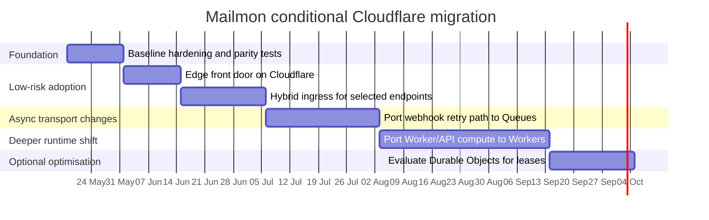

# Mailmon migration strategy and whether it should move to a Cloudflare stack

## Executive summary

Mailmon has already carried out one important migration inside the repository: from a local and legacy queueing model to a transport-neutral but strongly urlGoogle Cloudhttps://cloud.google.com-shaped architecture. The current repo is a TypeScript monorepo with separate API and worker apps, shared packages for core logic, config, database, Gmail integration, and queue adapters, plus OpenTofu-managed infrastructure and a GitHub Actions pipeline that builds containers, applies infra changes, and runs database migrations as a Cloud Run job. The async path is mailbox-scoped, not account-scoped, and is built around `PostgreSQL`, database-backed sync leases, Pub/Sub for Gmail push and sync dispatch, and Cloud Tasks for delayed webhook deliveries. fileciteturn29file0L1-L1 fileciteturn45file0L1-L1 fileciteturn58file0L1-L1 fileciteturn39file0L1-L1 fileciteturn36file0L1-L1 fileciteturn27file0L1-L1

A full move to a native urlCloudflarehttps://www.cloudflare.com stack is **not** a lift-and-shift. The biggest hard constraint is Gmail push delivery itself: Gmail’s `users.watch` requires a fully qualified Cloud Pub/Sub topic, and Google’s push-notification guide explicitly says the Gmail API uses Cloud Pub/Sub to deliver mailbox change notifications. That means a **pure zero-GCP design is not compatible with the current push-based Gmail architecture** unless Mailmon gives up push and falls back to polling. citeturn14search0turn14search1

The strongest near-term recommendation is therefore **conditional proceed, but only as a hybrid migration**. Mailmon should adopt Cloudflare first for DNS, TLS, CDN/WAF, edge ingress, and possibly selected Worker-based endpoints, while **retaining minimal Google Cloud components for Gmail Pub/Sub** and keeping the current database-backed lease and transaction model until parity is proven. A full rewrite to Workers, Queues, Durable Objects, and Hyperdrive is technically possible, but it is a materially larger programme with higher correctness risk, weaker rollback, and no evidence in the repo that Mailmon currently needs the more radical primitives to meet today’s requirements. fileciteturn36file0L1-L1 fileciteturn43file0L1-L1 citeturn4search1turn4search2turn11search1turn11search3turn6search6turn14search0

## What the repository’s migration strategy actually is

The repository’s core strategy is to keep domain logic transport-neutral while letting runtime adapters switch between local and GCP deployment modes. That is visible in the shared config package, which defaults both API and worker to `local`, but loads extra routing, topic, region, and service-account settings when `MAILMON_ASYNC_TRANSPORT_MODE=gcp`. The API runtime explicitly rejects `legacy_bullmq`, while the worker still supports it only as a legacy branch that requires Redis. fileciteturn25file0L1-L1 fileciteturn26file0L1-L1 fileciteturn24file0L1-L1

The more important architectural fact is that Mailmon’s durable invariants live in the database, not in the queueing layer. The schema stores mailbox state, active sync-lease ownership and expiry, sync runs, mailbox events, webhook deliveries, and replay bookkeeping in `PostgreSQL`. The mailbox-sync execution code acquires a lease, heartbeats it, applies the provider sync result, emits mailbox events, and classifies lease loss versus normal failure. A dedicated DB-backed test suite then verifies that sync finalisation is transactional, duplicate wake-ups do not create duplicate mailbox events, cursor regression is rejected, and failures roll back the transaction rather than leaving partial canonical state behind. fileciteturn39file0L1-L1 fileciteturn36file0L1-L1 fileciteturn43file0L1-L1

That matters because the repo’s migration strategy is **not** “queue first”. It is “database truth first, transport second”. The queue package pulls in `@google-cloud/pubsub` and `@google-cloud/tasks`; the worker package still depends on `google-auth-library`; the worker HTTP tests validate Pub/Sub push envelope decoding and Google-style internal authentication in GCP mode; and CI/CD still builds container images, authenticates to GCP through Workload Identity Federation, applies OpenTofu, and runs a Cloud Run migrations job. In other words, the repository has abstracted the application layer, but the operational layer is still deeply GCP-specific. fileciteturn58file0L1-L1 fileciteturn55file0L1-L1 fileciteturn44file0L1-L1 fileciteturn27file0L1-L1

The historical direction is also clear from the connected GitHub commit history returned by the connector: `583a6fa369f236a95effc772d3c91c0afa06d584` introduced GCP beta infra, `1e09c60500262b819ec439e66464d508d5ba78cf` added the deployment guide, `3d7bddeb325fc176dc847a7a3d49972556966ca7` updated the repo for Pub/Sub sync dispatch, and `dae8a23943f8b17f8f284194f25cd646b4c28c3d` completed the control-job dispatcher and readiness work. Those hashes show that the current migration path inside the repo has been **towards** GCP operational maturity, not away from it.

### Claim inventory from the relevant migration docs and code

The table below is a best-effort extraction of the **material** migration and deployment claims that affect a Cloudflare decision. I scoped this to the deployment guide, development guide, infrastructure plan, runtime/config code, schema, tests, and CI. All file references are against the current connected-repo HEAD blob set centred on commit `de809198d4c320f77d4556dde289a3729da996bb`; the line ranges are manual counts from the fetched blob text because the connector exposed file contents as single-line JSON payloads.

| Verbatim claim                                                                                                                         | File and approximate lines                         |        Commit | Verification                                                                                                                                                                                                                         |
| -------------------------------------------------------------------------------------------------------------------------------------- | -------------------------------------------------- | ------------: | ------------------------------------------------------------------------------------------------------------------------------------------------------------------------------------------------------------------------------------ |
| “Mailbox is the unit of work: All state is mailbox-scoped. No account-scoped queues or workflows.”                                     | `docs/DEVELOPMENT.md` ~L112-L113                   | `de809198...` | Supported by mailbox-scoped schema and sync execution model. fileciteturn45file0L1-L1 fileciteturn39file0L1-L1 fileciteturn36file0L1-L1                                                                                  |
| “Effect service interfaces: Transport-neutral contracts allow the same workflow to run locally or on GCP.”                             | `docs/DEVELOPMENT.md` ~L113-L114                   | `de809198...` | Supported by `MAILMON_ASYNC_TRANSPORT_MODE`, separate config branches, runtime tests, and queue adapter package. fileciteturn45file0L1-L1 fileciteturn25file0L1-L1 fileciteturn26file0L1-L1 fileciteturn58file0L1-L1 |
| “Transactional state commits: Sync finalization, cursor advancement, events, and lease release happen atomically.”                     | `docs/DEVELOPMENT.md` ~L114-L115                   | `de809198...` | Supported by the DB-backed finalisation tests that prove rollback on failure and event durability. fileciteturn45file0L1-L1 fileciteturn43file0L1-L1                                                                         |
| “Durable event log: All mailbox changes are recorded as immutable events in the database.”                                             | `docs/DEVELOPMENT.md` ~L115-L116                   | `de809198...` | Supported by `mailbox_events` schema and event-emission tests. fileciteturn45file0L1-L1 fileciteturn39file0L1-L1 fileciteturn43file0L1-L1                                                                                |
| “Database-backed leases: Only one sync executes per mailbox at a time, coordinated through the database.”                              | `docs/DEVELOPMENT.md` ~L116-L117                   | `de809198...` | Supported by schema lease fields and mailbox-sync execution code. fileciteturn45file0L1-L1 fileciteturn39file0L1-L1 fileciteturn36file0L1-L1                                                                             |
| “requires a worker base url when gcp mode is selected for the api”                                                                     | `packages/config/src/index.test.ts` ~L96-L116      | `de809198...` | Supported. The API cannot enter GCP mode without `MAILMON_WORKER_BASE_URL`. fileciteturn25file0L1-L1                                                                                                                             |
| “requires gcp routing values when worker gcp mode is selected”                                                                         | `packages/config/src/index.test.ts` ~L140-L175     | `de809198...` | Supported. Worker GCP mode requires project, region, topic, and service-account values. fileciteturn25file0L1-L1                                                                                                                 |
| “throws for legacy_bullmq mode”                                                                                                        | `apps/api/src/runtime.test.ts` ~L18-L27            | `de809198...` | Supported. The API runtime no longer supports BullMQ. fileciteturn26file0L1-L1                                                                                                                                                   |
| “requires redis when legacy bullmq mode is selected”                                                                                   | `apps/worker/src/index.test.ts` ~L31-L38           | `de809198...` | Supported. BullMQ remains only as a worker-side legacy path. fileciteturn24file0L1-L1                                                                                                                                            |
| “requires internal authentication outside local mode” and GCP envelope handling for `/internal/sync` and `/internal/gmail-push`        | `apps/worker/src/server.test.ts` multiple sections | `de809198...` | Supported. GCP mode assumes Google-style signed internal delivery. fileciteturn44file0L1-L1                                                                                                                                      |
| “Build & Deploy” including Google auth, OpenTofu apply, and “Run Database Migrations” via `gcloud run jobs execute mailmon-migrations` | `.github/workflows/ci.yml` ~L61-L171               | `de809198...` | Supported. Current deployment path is still fully GCP-based. fileciteturn27file0L1-L1                                                                                                                                            |
| “Cloud SQL (PostgreSQL 16, Enterprise Edition)” and “Secret Manager ‘containers’ for credentials”                                      | `deployment-progress.md` ~L8-L19                   | `de809198...` | Supported by deployment-progress tracking; operationally consistent with CI and docs. fileciteturn49file0L1-L1                                                                                                                   |

## Claim verification and documentation drift

Most of the repository’s substantive architectural claims are supported. The strongest ones are exactly the ones that matter for a migration decision: mailbox-scoped execution, DB-backed leases, transport-neutral use cases, and transactional sync finalisation. Those are not just aspirational doc statements; they are reflected in schema shape, runtime configuration, and DB-backed integration tests. fileciteturn45file0L1-L1 fileciteturn39file0L1-L1 fileciteturn36file0L1-L1 fileciteturn43file0L1-L1

There is also meaningful evidence that Mailmon has already invested in resilience work, but that evidence is still incomplete at the system level. The testing requirements document says the repo has moved beyond “mostly unit tests” and lists API contract tests, worker runtime tests, sandbox E2E, Gmail provider contract tests, DB-backed integration tests, and queue/runtime adapter tests. It also explicitly admits that the missing work is now infrastructure-level failure testing, chaos testing, heavier E2E against live Google, and repeatable load testing. That admission is credible and important: the repo is not under-tested, but it is **not yet migration-safe by default** for a deep platform rewrite. fileciteturn50file0L1-L1

The main unsupported or outdated claims are in the **development guide**, not in the core architecture. Several commands documented there do not appear in the root `package.json`: `pnpm dev:api`, `pnpm dev:worker`, and `pnpm db:push` are all documented, but the root scripts expose `pnpm dev`, `pnpm db:generate`, and `pnpm db:migrate` instead. The same guide tells operators to inspect a `mailbox_leases` table and to sort `sync_runs` and `mailbox_events` by `created_at`, but the current schema stores lease state on the `mailboxes` table and uses `started_at` / `occurred_at` timestamps instead. It also says infra is managed by Terraform, while CI clearly uses OpenTofu. Those are doc-drift problems rather than design problems, but they matter operationally because stale runbooks make migrations riskier. fileciteturn45file0L1-L1 fileciteturn29file0L1-L1 fileciteturn39file0L1-L1 fileciteturn27file0L1-L1

A second corrective finding is that some common Cloudflare-migration narratives are **not supported by the repo**. The current Mailmon schema stores canonical message metadata such as subject, sender, snippet, received time, and label IDs; it does **not** have a body/attachment object-store problem in the current design. That means an immediate move to R2 for raw message payloads may be a valid future design, but it is not solving an evidenced bottleneck in the present codebase. fileciteturn39file0L1-L1 fileciteturn33file0L1-L1

## What moving to Cloudflare would really change

### Current stack versus Cloudflare alternatives

| Concern                                  | Current Mailmon stack                                                               | Closest Cloudflare fit                                                                                              | Fit assessment                                 |
| ---------------------------------------- | ----------------------------------------------------------------------------------- | ------------------------------------------------------------------------------------------------------------------- | ---------------------------------------------- |
| DNS and front-door proxying              | Regional HTTP endpoints reached directly from clients and GitHub-driven GCP deploys | Cloudflare DNS with proxied records, TLS edge certs, WAF, and optional rate limiting                                | Strong fit; low code churn                     |
| Public API runtime                       | Node/Hono app using `@hono/node-server`, ports, env, and container deploy           | Workers HTTP runtime                                                                                                | Medium-high rewrite                            |
| Internal worker runtime                  | Node worker with Google-style internal auth assumptions and HTTP internal routes    | Workers + Queues + service bindings or DO RPC                                                                       | High rewrite                                   |
| Gmail push ingress                       | Gmail watch → Google Pub/Sub topic/subscription → worker endpoint                   | **No pure Cloudflare equivalent**; must retain Pub/Sub or drop push                                                 | Hard blocker for full migration                |
| Delayed webhook retries                  | Cloud Tasks plus DB delivery state                                                  | Queues with delay and retry, possibly DB idempotency and optional DO alarms                                         | Plausible                                      |
| Lease coordination                       | DB lease columns and heartbeat / recovery jobs                                      | Keep DB lease, or add Durable Objects per mailbox                                                                   | DB lease should stay first                     |
| Database access                          | `PostgreSQL` via `postgres.js`/Drizzle in Node runtime                              | Hyperdrive to regional `PostgreSQL`, possibly on urlNeonhttps://neon.com or urlSupabasehttps://supabase.com | Plausible but latency-sensitive                |
| Secrets                                  | Google Secret Manager via varlock plugin in app packages                            | Workers secrets / Secrets Store                                                                                     | Plausible with code change                     |
| Logging and metrics                      | GCP-centric runtime today, but test strategy still lists observability gaps         | Workers Logs, Metrics, Logpush, OTLP export                                                                         | Plausible but needs redesign                   |
| Load balancing and private origin access | Current stack is app-specific, not Cloudflare-fronted                               | Cloudflare Load Balancing and Tunnel                                                                                | Useful only if origins remain regional/private |

The repo evidence for the “current stack” side is in the app and package manifests, config tests, worker tests, schema, and CI workflow. The “Cloudflare fit” side comes from official Cloudflare docs on Workers limits and Node compatibility, Queues, Durable Objects, Hyperdrive, Logs, Metric dashboards, Secrets, Tunnel, Load Balancing, DNS proxying, and TLS. fileciteturn54file0L1-L1 fileciteturn55file0L1-L1 fileciteturn56file0L1-L1 fileciteturn58file0L1-L1 fileciteturn25file0L1-L1 fileciteturn44file0L1-L1 fileciteturn27file0L1-L1 citeturn12search2turn4search2turn11search2turn11search3turn6search6turn7search2turn10search4turn7search4turn8search3turn8search1turn9search2turn8search0

### The hard compatibility findings

The first non-negotiable compatibility issue is Gmail push. Gmail’s own docs say that Gmail push notifications use Cloud Pub/Sub, and the `users.watch` method requires a fully qualified Pub/Sub topic name in the same Google developer project. That means the “queue replacement” problem is not symmetrical: Mailmon can replace some **internal** queueing with Cloudflare primitives, but it cannot replace the **upstream Gmail trigger** with a native Cloudflare service. The cleanest hybrid is Gmail → Google Pub/Sub → push subscription → Cloudflare Worker endpoint, which still leaves a minimal Google control plane in place. citeturn14search0turn14search1turn13search0turn13search1turn13search3

The second issue is runtime shape. Cloudflare Workers provide a subset of Node APIs, and some Node modules are partial or import-only stubs. Mailmon’s runtime surface is not minimal: the API and worker packages depend on `@hono/node-server`; the worker uses `google-auth-library`; the queue package imports the Google Pub/Sub and Cloud Tasks SDKs; the DB package uses `postgres`; and the Gmail package uses `node:crypto`. Hyperdrive is a real positive because Cloudflare says it works with existing Postgres drivers and ORMs and pools connections near the origin database, but the current entrypoints are still clearly Node-server entrypoints rather than Worker handler entrypoints. In practice, this is a port, not a config flip. fileciteturn54file0L1-L1 fileciteturn55file0L1-L1 fileciteturn56file0L1-L1 fileciteturn58file0L1-L1 fileciteturn33file0L1-L1 citeturn4search2turn6search6turn6search0turn6search10

The third issue is execution and scheduling semantics. For background work, Cloudflare gives queue consumers and Durable Object alarms up to 15 minutes of wall-clock time, while HTTP Workers have no hard wall-clock limit as long as the client stays connected. `ctx.waitUntil()` only extends work for up to 30 seconds after response end. That is good enough for many webhook and dispatch flows, but it means long-running historical sync must be chunked if moved into non-HTTP background handlers. This is manageable, but it is a real refactor. citeturn12search2turn15search4turn4search0turn11search0

The fourth issue is the lease model. Durable Objects are strongly consistent, single-threaded, globally unique coordination points and are therefore a plausible per-mailbox serialiser. But Mailmon’s strongest invariant today is that lease ownership, sync-run state, cursor advancement, and mailbox events all live on the same persistence boundary and are tested transactionally. Replacing DB leases with Durable Objects too early would create a split-brain design in which coordination state lives in one system and final state lives in another. That is exactly the kind of migration that looks elegant on architecture diagrams and then fails under retries, partial commits, and rollback. Durable Objects are better treated as an optional later optimisation, not a phase-one substitution. fileciteturn36file0L1-L1 fileciteturn43file0L1-L1 citeturn11search1turn11search3turn11search4

The fifth issue is that some proposed Cloudflare replacements are weaker than they look. Workers KV is explicitly eventually consistent and Cloudflare recommends Durable Objects when you need stronger consistency or atomic coordination. Cloudflare WAF rate-limiting counters are not globally shared across the entire network, which makes them unsuitable as a strict global Gmail quota governor. So if Mailmon ever needs a truly global token bucket for Gmail API protection, that belongs in a dedicated per-project Durable Object or in the database, not in WAF rate limiting and not in KV. citeturn15search1turn10search5

### Cost, ingress, observability, and operations

Cloudflare is clearly attractive on unit economics and front-door capability. Workers pricing starts with a low paid-plan floor and no egress fees, R2 storage is cheap and egress-free, Queues are metered by operations, Durable Objects add request and duration/storage billing, and Hyperdrive is designed to reduce connection overhead to a regional database. The cost case is strongest for ingress, TLS, WAF, and low-latency compute at the edge. It is weakest where Mailmon remains anchored to a regional database or to Gmail’s Google-side Pub/Sub control plane. Since traffic volume, mailbox count, webhook fan-out, and retry volumes are unknown, total monthly savings cannot be estimated credibly from the repo alone. citeturn6search1turn5search1turn5search0turn6search6turn6search0turn6search10

Cloudflare is also strongest on the front door. Proxied DNS records put HTTP traffic through Cloudflare, proxied-record TTL is fixed at 300 seconds, Universal SSL and edge certificates are automatic, WAF and rate limiting are integrated, Load Balancing is an add-on, and Tunnel gives a secure outbound-only path to private origins. For Mailmon, that suggests an obvious low-risk first move: put Cloudflare in front of the existing public API and any regional origins before touching the async core. That path gives security and traffic-management benefits with almost none of the application risk of a full Worker rewrite. citeturn9search2turn9search4turn8search0turn8search10turn9search6turn10search0turn8search1turn8search3

On observability, Workers Logs, metrics, Logpush, and OTLP export are credible, but they are not a free crossover. Workers Logs on the paid plan include 7-day retention and additional billing after the included volume. Cloudflare’s metrics cover request counts, error rates, CPU time, wall time, and execution duration. That is enough to operate the system, but the repo’s own test strategy already admits that infrastructure-level failure testing and load testing are still weak points. A platform migration would therefore require observability design as a first-class workstream rather than something that can be “picked up later”. fileciteturn50file0L1-L1 citeturn7search2turn7search3turn10search4

## Risks, compatibility gaps, and phased migration plan

### Risk matrix

| Risk                                                    | Probability | Impact   | Why it matters                                                                                                                                                                                                                            | Mitigation                                                                                                                |
| ------------------------------------------------------- | ----------- | -------- | ----------------------------------------------------------------------------------------------------------------------------------------------------------------------------------------------------------------------------------------- | ------------------------------------------------------------------------------------------------------------------------- |
| Gmail push cannot be made pure-Cloudflare               | High        | Critical | Gmail requires Cloud Pub/Sub topics for `watch`; removing GCP means abandoning push. citeturn14search0turn14search1                                                                                                                   | Keep minimal GCP Pub/Sub indefinitely, or explicitly choose a polling architecture and absorb its cost/latency trade-off. |
| Worker runtime port is larger than expected             | High        | High     | Current apps are Node-server based and depend on Google SDKs, `postgres`, varlock, and Node APIs. fileciteturn54file0L1-L1 fileciteturn55file0L1-L1 fileciteturn56file0L1-L1 fileciteturn58file0L1-L1 citeturn4search2 | Separate edge-friendly handlers from Node-only adapters before any deployment move.                                       |
| Split-brain correctness if leases move to DOs too early | Medium      | Critical | Repo invariants currently rely on DB transaction boundaries and lease state in the same data model. fileciteturn36file0L1-L1 fileciteturn43file0L1-L1                                                                             | Keep DB lease model through early phases; if DOs are later added, use them only as a serialiser in front of the DB.       |
| Background execution limits break long sync             | Medium      | High     | Queue consumers and alarms cap at 15 minutes wall-clock; `waitUntil()` only extends 30 seconds. citeturn12search2turn15search4turn4search0                                                                                           | Explicitly chunk Gmail history sync and persist continuation state.                                                       |
| Regional database latency erodes edge gains             | Medium      | High     | Workers at the edge talking to one regional DB can shift the bottleneck to database latency. Hyperdrive helps but does not remove all hops. citeturn6search6turn6search0turn6search10turn6search9                                   | Keep heavy DB-bound flows region-aware; use Placement Hints/Smart Placement carefully; benchmark before moving hot paths. |
| WAF/KV used for hard coordination by mistake            | Medium      | High     | KV is eventually consistent, and WAF rate counters are not globally shared. citeturn15search1turn10search5                                                                                                                            | Reserve KV for config/cache; use DB or Durable Objects for coordination.                                                  |
| Rollback becomes ambiguous across queues, DOs, and DB   | Medium      | High     | Multi-service cutovers make it hard to know which system is source of truth.                                                                                                                                                              | Use shadow mode, dual-writing only where strictly needed, and phase boundaries with hard rollback criteria.               |
| Cost surprise from DO duration or logs                  | Medium      | Medium   | Durable Objects bill for duration; Workers Logs bill after included volume. citeturn5search0turn7search2                                                                                                                              | Model costs with mailbox counts, hot-object behaviour, log volume, and retry rates before production rollout.             |
| Monitoring gaps hide failed retries or stuck syncs      | Medium      | High     | Repo itself still lists chaos and infra-level failure testing as missing. fileciteturn50file0L1-L1                                                                                                                                    | Define SLOs and red/black dashboards before any transport cutover.                                                        |

### Recommended migration sequence

The most defensible migration order is **front door first, async core last**. The repo’s current architecture is already transport-neutral enough that front-door services can move earlier than background coordination.

| Phase                       | Scope                                                                                                                  |    Estimated effort | Complexity  | Exit criteria                                                                               | Rollback criteria                                                  |
| --------------------------- | ---------------------------------------------------------------------------------------------------------------------- | ------------------: | ----------- | ------------------------------------------------------------------------------------------- | ------------------------------------------------------------------ |
| Baseline hardening          | Fix stale docs, add a transport-parity checklist, add benchmark and chaos tests around queue, lease, and webhook paths |  1–2 engineer-weeks | Medium      | Updated runbooks, repeatable perf baseline, explicit queue/retry invariants                 | If parity tests are not stable, stop here                          |
| Edge front door             | Cloudflare DNS, proxied records, TLS, WAF, rate limiting, optional Tunnel/Load Balancing in front of existing origins  |  1–2 engineer-weeks | Low–Medium  | No app-code regression, security policy validated, latency/error budget unchanged or better | Revert DNS/proxy changes if 5xx, auth, or webhook delivery regress |
| Hybrid ingress              | Move selected public or webhook ingress endpoints to Workers while keeping current worker/database/GCP async core      |  2–4 engineer-weeks | Medium      | Request auth, webhook signing, and observability parity proven in staging                   | Route traffic back to current API endpoints                        |
| Webhook queue port          | Replace Cloud Tasks with Queues for delayed webhook retries if retry windows fit Queues semantics                      |  3–5 engineer-weeks | Medium–High | Delivery correctness, backoff, retry exhaustion, and idempotency proven                     | Restore Cloud Tasks path and disable new consumer                  |
| Worker-native compute       | Port API and/or worker runtimes to Workers + Hyperdrive while retaining Gmail on Google Pub/Sub                        | 6–10 engineer-weeks | High        | CPU, memory, DB latency, auth, and E2E parity proven under load                             | Route compute back to containers                                   |
| Optional mailbox serialiser | Evaluate Durable Objects only after production evidence shows DB-lease bottlenecks                                     |  3–6 engineer-weeks | High        | Measured reduction in contention or recovery lag with no invariant regression               | Remove DO path; keep DB as sole coordinator                        |

These effort bands are an engineering inference from the repo’s dependency surface, current tests, and Cloudflare’s platform constraints rather than a vendor-provided estimate. The evidence for the complexity judgement is the present Node/GCP coupling in package manifests, CI, runtime tests, and the database-first execution model. fileciteturn54file0L1-L1 fileciteturn55file0L1-L1 fileciteturn56file0L1-L1 fileciteturn58file0L1-L1 fileciteturn27file0L1-L1 fileciteturn36file0L1-L1 fileciteturn50file0L1-L1 citeturn12search2turn6search6turn14search0

The Gantt reflects the recommended sequencing above: first stabilise and document invariants, then adopt Cloudflare where it behaves as an infrastructure layer, then only later touch queueing and execution, and only last revisit the lease model. fileciteturn50file0L1-L1 fileciteturn36file0L1-L1 fileciteturn43file0L1-L1 citeturn14search0turn12search2turn11search1turn11search3

## Recommendation

The recommendation is **conditional proceed**, with a very specific meaning:

**Proceed with Cloudflare as a front-door and selected edge-ingress platform. Do not proceed with a full “move Mailmon to Cloudflare” rewrite now.**

That recommendation follows directly from the evidence.

The repository is already coherent around a GCP-era design: Gmail push through Pub/Sub, internal dispatch and retries through GCP queueing, Google-style internal auth in worker mode, and a tested database transaction boundary that owns correctness. A rushed platform rewrite would replace several solved invariants at once: queue semantics, background execution limits, connection management, secrets, auth, and lease coordination. The repo does not show the sort of current pain that would justify taking all of those risks in one move, and its own testing roadmap still calls out missing infrastructure-failure and load validation. fileciteturn44file0L1-L1 fileciteturn27file0L1-L1 fileciteturn36file0L1-L1 fileciteturn43file0L1-L1 fileciteturn50file0L1-L1

What **does** make sense is selective adoption where Cloudflare is strongest and least invasive: DNS, TLS, WAF, rate limiting, global edge ingress, possibly Tunnel/Load Balancing for regional/private origins, and perhaps a Worker-based ingress layer that terminates public traffic before handing off to the existing core. That path improves security posture and operational flexibility while preserving the database-first correctness model and the Gmail Pub/Sub dependency that the application cannot realistically avoid today. citeturn9search2turn8search0turn9search6turn10search0turn8search1turn8search3turn14search0turn14search1

If the strategic goal is genuinely “eliminate as much GCP as possible”, the rational target is not “all Cloudflare”; it is “Cloudflare plus a **minimal Google Pub/Sub island** kept solely because Gmail requires it”. If that residual Google footprint is politically or commercially unacceptable, then the only clean alternative is to redesign Mailmon around polling rather than push, which would be a product and cost-model change, not just an infrastructure migration. citeturn14search0turn14search1

## Open questions and limitations

Some inputs that materially affect the recommendation are unknown: production request volume, mailbox count, webhook fan-out, retry profile, retry windows, current GCP bill, target SLA/SLO, data-residency requirements, and whether “Cloudflare stack” means “front door plus compute” or “complete exit from Google”. Without those, the cost analysis can only compare billing models and rewrite scope, not forecast actual monthly spend. citeturn6search1turn5search0turn5search1turn7search2

The GitHub connector exposed file contents as single-line JSON payloads, so the claim inventory above uses manual line counts rather than machine-generated line spans. The architectural conclusions, however, are based on multiple independent repo sources: docs, package manifests, schema, runtime/config tests, transactional DB tests, worker HTTP tests, CI, and deployment-progress tracking. fileciteturn45file0L1-L1 fileciteturn54file0L1-L1 fileciteturn55file0L1-L1 fileciteturn56file0L1-L1 fileciteturn39file0L1-L1 fileciteturn36file0L1-L1 fileciteturn43file0L1-L1 fileciteturn44file0L1-L1 fileciteturn27file0L1-L1 fileciteturn49file0L1-L1
